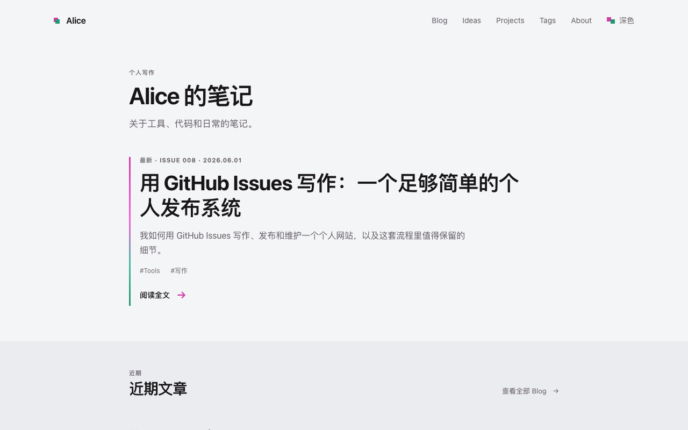
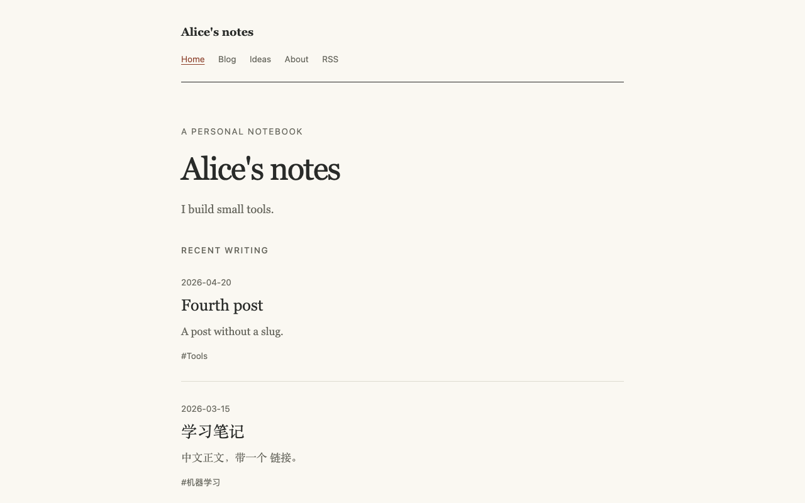
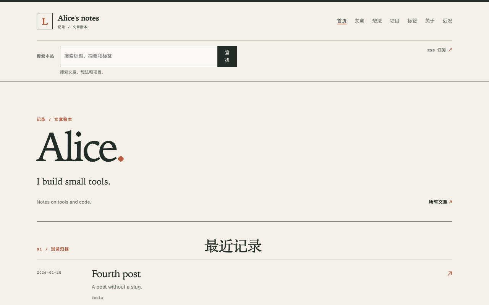
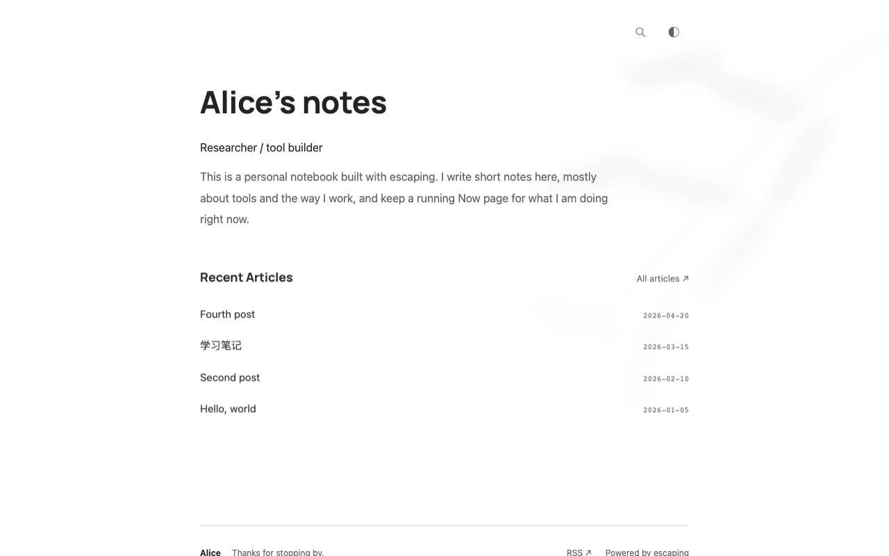

# escaping themes

Themes for [escaping](https://github.com/geoqiao/escaping), the generator that
builds a website from the GitHub Issues of a repository. Each folder is one
Theme; a tag such as `v1.0.0` versions all of them.

## Use one

Write one line in your site's `config.yaml`:

```yaml
theme:
  use: github.com/geoqiao/escaping-themes/paper@v1.0.0
```

Replace `paper` with the folder of the Theme you want. escaping 0.4.0 and
later download that folder at that version on every build; to update, change
the version. Each Theme's README lists its options and the `pages` settings it
needs. See
[Using a Theme from GitHub](https://github.com/geoqiao/escaping/blob/main/docs/themes/authoring.md#using-a-theme-from-github)
for replacing a few files of a Theme, and for escaping 0.3.0, which needs a
copy of the folder instead.

## Themes

### [Escape1](escape1/)

A minimal reading column on a warm off-white page, with dark mode and Prism code
highlighting. Every page kind. Formerly built into escaping.


### [Escape2](escape2/)

A dark, Nord-coloured terminal look with a `user@escaping ~ $` prompt,
monospace headings and a full-screen menu on phones. Every page kind. Formerly
built into escaping.


### [geoqiao.me](geoqiao-me/)

A Chinese-first writer's site: a Home that leads with the newest post,
editorial index rows, a 720px reading column with a section outline, and a
magenta-and-mint mark you can replace. Chinese and English interface. Every
page kind. Formerly built into escaping.



### [Paper](paper/)

A small notebook: warm paper colours, serif text, no JavaScript. Needs
`pages: {tags: false, projects: false}`.



### [Ledger](ledger/)

A field-journal look with ruled sections, in English and Chinese. Every page
kind, plus templates for a `/now/` page and one page per project.



### [Quiet Notes](quiet-notes/)

escaping's built-in Quiet with its own Home introduction, stylesheet and
display font, and a `/now/` page.



## Adding or changing a Theme

Put the Theme in its own folder with `theme.yaml`, a README, a LICENSE and a
`screenshot.png`, and add a config for it to `.github/check/`. The
[check workflow](.github/workflows/check.yml) runs `escpe theme check` on every
Theme, once at the root of a host and once under a path. See the
[Theme guide](https://github.com/geoqiao/escaping/blob/main/docs/themes/authoring.md).

Every Theme here is MIT licensed; bundled third-party files are credited in
each Theme's README.
