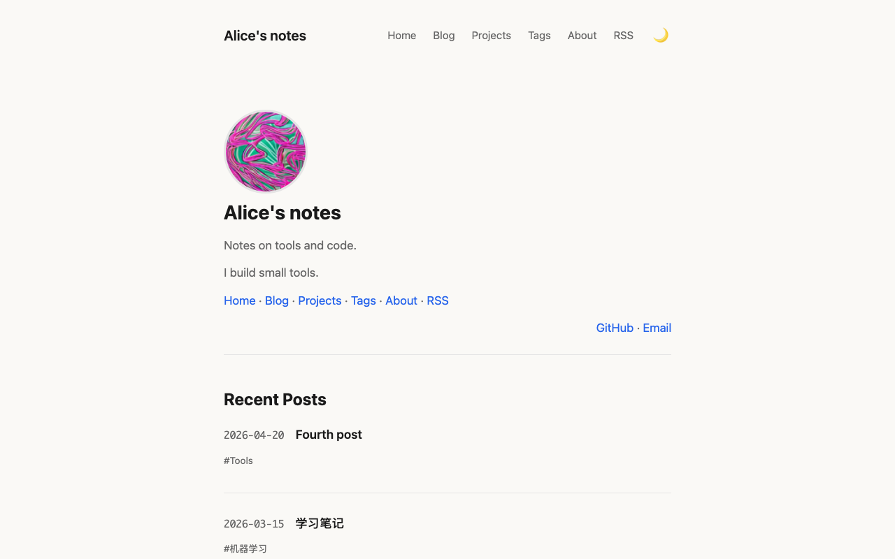

# Escape1

Escape1 is a minimal reading Theme for [escaping](https://github.com/geoqiao/escaping):
one narrow column on a warm off-white page, a sans-serif body with monospaced
dates, blue links, and a dark mode that follows the reader's system setting until
they pick one with the moon/sun button. On small screens the menu folds into a
hamburger button that works with the keyboard (Enter/Space to open, Escape to
close). Code blocks are highlighted by a bundled copy of Prism with a Copy button,
Mermaid diagrams are drawn with escaping's shared loader, and Utterances comments
appear on Issue-backed pages when the site turns them on. It was a built-in Theme
of escaping 0.1 and is ported here, unchanged in look, to
**Theme API 4** (escaping 0.3.0 and later). It needs no build tools and loads nothing from
other sites except the comments widget.



## Use it

Write one line in your site's `config.yaml`:

```yaml
theme:
  use: github.com/geoqiao/escaping-themes/escape1@v1.0.0
```

escaping 0.4.0 and later download this folder at that version on every build.
To update, change the version. To replace a few files, make a folder of your
own with a `theme.yaml` that says `api: 4` and
`extends: github.com/geoqiao/escaping-themes/escape1@v1.0.0`, add only the files
you change, and set `theme: {use: ./theme}`; `@escape1/` reaches the
originals. See
[Using a Theme from GitHub](https://github.com/geoqiao/escaping/blob/main/docs/themes/authoring.md#using-a-theme-from-github).
With escaping 0.3.0, copy this folder into your site and set
`use: ./escape1` instead.

Check the result before deploying:

```sh
escpe theme check --config config.yaml
escpe build --config config.yaml --issues-json issues.json   # offline build with saved Issues
```

## Options

Set them under `theme.options` in `config.yaml`; every one is optional.

| Option | Type | Default | What it does |
| --- | --- | --- | --- |
| `show_powered_by` | boolean | `true` | Show "powered by escaping" after the author name in the footer |
| `comments_theme` | choice: `github-light`, `github-dark`, `preferred-color-scheme`, `github-dark-orange`, `icy-dark`, `dark-blue`, `photon-dark`, `boxy-light`, `gruvbox-dark` | `github-light` | Utterances colours, used when `comments_theme_mode` is `fixed` |
| `comments_theme_mode` | choice: `auto`, `fixed` | `auto` | `auto` follows Escape1's light/dark mode (github-light / photon-dark); `fixed` always uses `comments_theme` |

```yaml
theme:
  use: github.com/geoqiao/escaping-themes/escape1@v1.0.0
  options:
    show_powered_by: false
```

Everything else comes from the usual site fields: `site.title`, `site.author`,
`site.description`, `site.navigation` (the header menu, repeated as a line of
links on Home), `profile.avatar`, `profile.bio` and `profile.links`,
`seo.google_search_console`, `seo.social_image` and `seo.social_image_alt`
(without a social image, pages use the Theme's icon as `og:image`), and
`comments.enabled` / `comments.repo`.

Interface text is English (`strings.en` in `theme.yaml`) whatever
`site.language` is. To translate it, add a `zh:` (or other language) block with
the same keys to `theme.yaml`.

## Pages

Escape1 has a template for every page escaping builds, so any combination of
`pages` settings works, including `ideas: false`, `tags: false`,
`projects: false`, `about: false` and moved sections such as `blog: /posts/`.
Links to a page that is off are not shown; tags on posts become plain text when
`tags: false`.

| Page | Template | What it shows |
| --- | --- | --- |
| Home | `home.html` | Avatar, site title, description, bio, menu links and profile links, then the five newest posts |
| Blog, page 2 and later | `blog.html` | Dated titles with tags, `← Prev` / `n / total` / `Next →` pagination |
| Post | `post.html` | Title, date and tags, body, comments |
| Ideas | `blog.html` | "Ideas" heading and dated titles |
| Idea | `post.html` | Same layout as a post |
| About from an Issue | `post.html` | "About", avatar, bio, the Issue body, profile links, comments |
| About from the profile | `post.html` | Author name, avatar, bio and profile links; no comments |
| Tags | `tags.html` | Every tag with its post count |
| Tag | `blog.html` | `#tag` heading and its posts |
| Projects | `projects.html` | Title, summary, language and stars; links to a project's own page when the site has one |
| 404 | `404.html` | "Page not found" and a link Home |

Escape1 ships no templates for `pages.extra`, so there are no extra-page lines
to copy. Sites under a path such as `https://alice.github.io/notes/` work
without changes: every Theme address goes through the `url` filter.

## Moving from the built-in Escape1 (escaping 0.1)

| Old `config.yaml` | Now |
| --- | --- |
| `theme: {source: builtin, name: Escape1}` | `theme: {use: github.com/geoqiao/escaping-themes/escape1@v1.0.0}` |
| `branding.show_powered_by` | `theme.options.show_powered_by` (`powered_by_text` and `powered_by_url` are gone; the footer reads "powered by escaping") |
| `comments.theme`, `comments.theme_mode` | `theme.options.comments_theme`, `theme.options.comments_theme_mode` |

Theme files moved from `/templates/Escape1/static/` to `/assets/`. Differences
you may notice:

- The footer no longer reads "powered by Powered by" with the old default
  `branding.powered_by_text`.
- Idea pages use the post layout (date and `#tags` under the title) instead of
  an unstyled "created / tags" list that showed tags as `##tag`.
- Mermaid diagrams use dark colours when the page opens in dark mode; before,
  their arrows were nearly invisible on the dark background.
- The saved or system colour scheme is applied in `<head>`, so dark-mode
  readers no longer see a light flash while the page loads.

## Files and licenses

Escape1 is MIT licensed; see [LICENSE](LICENSE). It includes:

| File | Origin | License |
| --- | --- | --- |
| `static/js/prism.js`, `static/css/prism.css` | [PrismJS](https://prismjs.com/) 1.29.0 custom build (languages: markup, css, clike, javascript, bash, c, csharp, cpp, git, go, java, plsql, python, r, ruby, rust, scala, sql, swift, typescript, typoscript, yaml, zig; plugins: toolbar, copy-to-clipboard, treeview), with the build header kept at the top of each file | MIT, Copyright (c) 2012 Lea Verou; full text in `static/js/prism-LICENSE.txt` |
| `static/css/style.css`, `static/js/theme.js`, `static/images/favicon.png`, templates | escaping's former built-in Escape1 | MIT (this folder's LICENSE) |

The comments script and the Mermaid loader and runtime are not in this folder:
escaping publishes them for every Theme under `/assets/escaping/`, with
Mermaid's own license.
