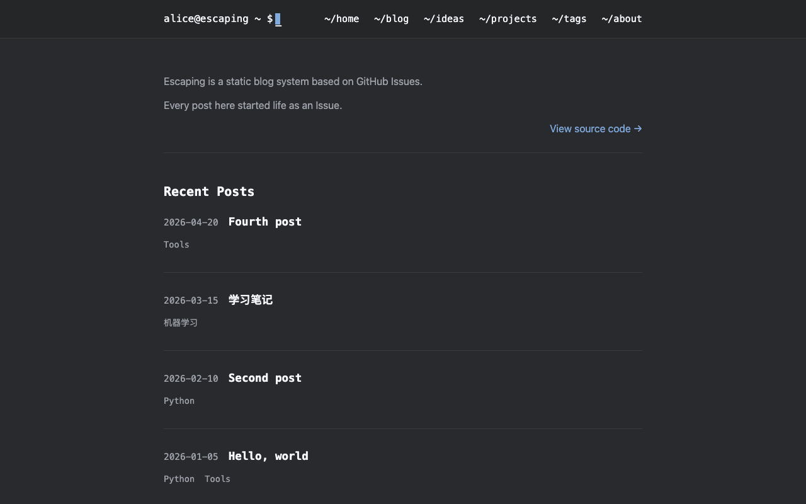

# Escape2

Escape2 is a dark, Nord-inspired terminal Theme for [escaping](https://github.com/geoqiao/escaping):
a `user@escaping ~ $` prompt with a blinking cursor, `~/section` menu links,
monospace headings, cool blue accents, Nord code highlighting and a
full-screen menu on small screens. It uses system fonts only and loads nothing
from other sites (comments excepted, when you turn them on). It was a built-in
Theme of escaping 0.1; this folder is the same design ported to Theme API 4. It
does not depend on Quiet.



## Compatibility

- Theme API **4** (escaping 0.3.0 and later), no `extends`.
- Interface text is English. `site.language` still sets the page's `lang`.
- Works at the root of a host and under a path such as
  `https://alice.github.io/notes/`.

## Install

Write one line in your site's `config.yaml`:

```yaml
theme:
  use: github.com/geoqiao/escaping-themes/escape2@v1.0.0
```

escaping 0.4.0 and later download this folder at that version on every build.
To update, change the version. To replace a few files, make a folder of your
own with a `theme.yaml` that says `api: 4` and
`extends: github.com/geoqiao/escaping-themes/escape2@v1.0.0`, add only the files
you change, and set `theme: {use: ./theme}`; `@escape2/` reaches the
originals. See
[Using a Theme from GitHub](https://github.com/geoqiao/escaping/blob/main/docs/themes/authoring.md#using-a-theme-from-github).
With escaping 0.3.0, copy this folder into your site and set
`use: ./escape2` instead.

Check the site before deploying:

```sh
escpe theme check --config config.yaml
escpe build --config config.yaml --issues-json issues.json
```

## Options

Set these under `theme.options` in `config.yaml`. All are optional.

| Option | Type | Default | What it does |
| --- | --- | --- | --- |
| `thesis` | list | `[]` | Lines shown at the top of Home, one paragraph each. Blank lines are skipped. |
| `source_link_url` | url | `""` | Adds a "View source code →" link under the thesis on Home. Empty hides it. |
| `show_powered_by` | boolean | `true` | Shows the "Powered by" link in the footer. |
| `powered_by_text` | string | `""` | Text of that link. Empty uses "Powered by". |
| `powered_by_url` | url | `https://github.com/geoqiao/escaping` | Target of that link. Empty hides it. |
| `comments_theme` | choice | `photon-dark` | Utterances theme used when `comments_theme_mode` is `fixed`: `photon-dark`, `github-dark`, `github-dark-orange`, `icy-dark`, `dark-blue`, `gruvbox-dark`, `github-light`, `boxy-light`, `preferred-color-scheme`. |
| `comments_theme_mode` | choice | `auto` | `auto` follows the page, which is always dark, so comments use `photon-dark`. `fixed` always uses `comments_theme`. |

A `url` option accepts an HTTPS, `mailto:`, root-relative (`/about/`) or
`#fragment` link. Escape2 puts a root-relative link under the site's path.

Example:

```yaml
theme:
  use: github.com/geoqiao/escaping-themes/escape2@v1.0.0
  options:
    thesis:
      - Escaping is a static blog system based on GitHub Issues.
    source_link_url: https://github.com/geoqiao/escaping
```

### Coming from the built-in Escape2 of escaping 0.1

escaping 0.3.0 rejects the old site fields. Move them here:

| escaping 0.1 `config.yaml` | Escape2 option |
| --- | --- |
| `site.thesis` | `theme.options.thesis` |
| `branding.source_link_url` | `theme.options.source_link_url` |
| `branding.show_powered_by` | `theme.options.show_powered_by` |
| `branding.powered_by_text` | `theme.options.powered_by_text` |
| `branding.powered_by_url` | `theme.options.powered_by_url` |
| `comments.theme`, `comments.theme_mode` | `theme.options.comments_theme`, `theme.options.comments_theme_mode` |
| `theme: {source: builtin, name: Escape2}` | `theme: {use: github.com/geoqiao/escaping-themes/escape2@v1.0.0}` |

Theme files moved from `/templates/Escape2/static/…` to `/assets/…`.

## Pages

Escape2 has a template for every page kind of escaping 0.3.0, so every
`pages.*` setting works, including `false`. Pages that are off get no links:
escaping leaves them out of the default menu (and rejects explicit menu links
to them), Escape2 links to no section on its own, and tags become plain text
when `pages.tags: false`.

| Page | Template | What it shows |
| --- | --- | --- |
| Home | `home.html` | The thesis and source link (when set), then the five newest posts with date and tags. It does not follow `paths.page_size`. |
| Blog, and `/blog/page/2/`, … | `blog.html` | Posts with date and tags; `← prev` / `next →` when there is more than one page. |
| Post | `post.html` | Title, a `tags:` / `created:` box, the body, comments. |
| Ideas list | `blog.html` | Ideas with date and tags. |
| Idea | `post.html` | Same layout as a post. |
| Tags | `tags.html` | Every tag with its post count. |
| One tag | `blog.html` | `#tag` and its posts. |
| Projects | `projects.html` | Title, language, summary, stars, forks and topics. Links to the project's own page when the site has one, otherwise its website or repository. |
| About from an Issue | `about.html` | "About", the avatar, the profile bio, the Issue body, profile links, comments. |
| About from the profile | `about.html` | The author's name, the avatar, the bio and profile links; no comments. |
| 404 | `404.html` | "Page not found" and a link Home. |

Without `profile.avatar`, About shows the bundled `static/images/author-mark.png`.
Replace that file, or set `profile.avatar`, to show your own picture.

Escape2 ships no templates for `pages.extra`, so it has no extra-page lines to
copy.

## Behavior

- **Header.** The prompt shows the owner of `github.repo` (`alice@escaping ~ $`).
  Menu links are printed as `~/<name>`. With `site.navigation.items: []` the
  header shows only the prompt.
- **Small screens.** At 768px and below the menu becomes a full-screen panel
  behind a button with `aria-expanded`. Enter or Space toggles it; Escape closes
  it and returns focus to the button. Without JavaScript, or if the inline
  script is blocked, the links stay visible under the prompt.
- **Keyboard.** A skip link appears on the first Tab; every link has a visible
  focus ring.
- **Reduced motion.** With `prefers-reduced-motion: reduce` the cursor stops
  blinking, the menu opens without animation and scrolling is instant.
- **Code.** Prism (bundled, no CDN) highlights code with Nord colors and adds a
  copy button on hover. Its bundle covers markup/HTML, CSS, JavaScript,
  TypeScript, Bash, C, C#, C++, Go, Java, PL/SQL, Python, R, Ruby, Rust, Scala,
  SQL, Swift, YAML, Zig, Git and TypoScript. Code in other languages shows as
  plain text.
- **Diagrams.** Posts, Ideas and an Issue About include escaping's Mermaid
  loader with the dark Mermaid theme. It fetches the Mermaid runtime only on a
  page that has a diagram.
- **Comments.** With `comments.enabled: true`, posts, Ideas and an Issue About
  show Utterances through escaping's shared script. If comments cannot load,
  a link to the Issue on GitHub appears instead. Install the
  [Utterances app](https://github.com/apps/utterances) on the comments repository.
- **Head.** Every page has a title, description, canonical link, Open Graph and
  Twitter tags, and escaping's JSON-LD. The preview image is `seo.social_image`
  when set, otherwise the Theme favicon. The Google verification tag appears
  when `seo.google_search_console` is set.
- **Search.** Escape2 has no search box; escaping still writes `search.json`.

## Translating

Interface text is in `theme.yaml` under `strings.en`. To translate it, add a
language block with the same keys, for example `strings.zh` for
`site.language: zh` or `zh-CN`. Keys you leave out stay English.

## Credits and licenses

Escape2 is MIT licensed, like escaping; see [LICENSE](LICENSE), which also holds
the full license texts of the third-party files.

| File | Source | License |
| --- | --- | --- |
| `static/js/prism.js` | [PrismJS](https://prismjs.com/) 1.29.0, © 2012 Lea Verou; core, the languages above, toolbar, copy-to-clipboard and treeview plugins | MIT |
| `static/css/prism-nord.css` | [prism-themes](https://github.com/PrismJS/prism-themes), © 2015 PrismJS; [Nord](https://www.nordtheme.com/) palette by Arctic Ice Studio, ported by Zane Hitchcox and Gabriel Ramos | MIT |
| `static/images/favicon.png`, `static/images/author-mark.png` | escaping's own images | MIT, with the Theme |

Both Prism files are unchanged from the copies escaping 0.1 shipped; their
header comments are kept.
